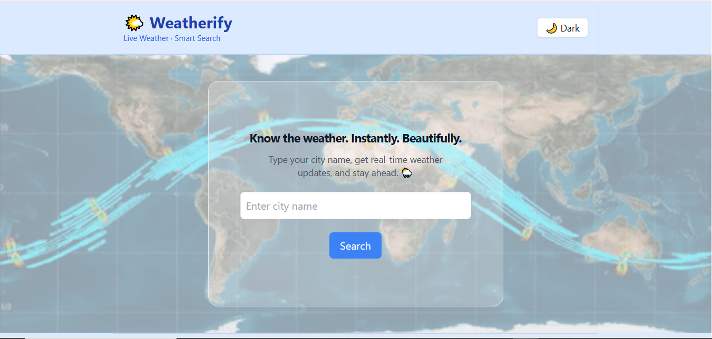

# 🌤️ Weatherify

A clean, responsive weather app built with React, Redux Toolkit, and Tailwind CSS — featuring real-time weather data, smart city autocomplete using GeoDB API, dark mode, animated weather map background, and more.

---

## 🚀 Live Demo

🔗 [https://ibrahim-weatherify.vercel.app](https://ibrahim-weatherify.vercel.app)

---

## 📦 GitHub Repository

📁 [https://github.com/mdiibrahim/weather-app](https://github.com/mdiibrahim/weather-app)

---

## 💻 Local Development

Run locally:

```
http://localhost:5173/
```

---

## 📸 Preview



---

## 🛠️ Features

- 🔍 **Smart Search** – Autocomplete for city names using GeoDB Cities API
- 🌡️ **Real-time Weather** – Fetches live data from OpenWeatherMap
- 🌓 **Dark Mode** – Toggle UI between light and dark themes
- 📍 **Search History** – Remembers last 5 searched cities with remove option
- 📱 **Responsive UI** – Tailwind-powered layout optimized for all screen sizes
- 🗺️ **Weather Map Background** – Animated GIF map adds visual appeal
- ⚙️ **Redux Toolkit** – Global state management for weather info

---

## 🔧 Setup Instructions

1. **Clone this repo**

```bash
git clone https://github.com/mdiibrahim/weather-app.git
cd weather-app
```

2. **Install dependencies**

```bash
yarn install
# or
npm install
```

3. **Set up environment variables**
   Create a `.env` file in the root:

```env
VITE_OPENWEATHER_API_KEY=your_openweathermap_key
VITE_GEODB_API_KEY=your_geodb_api_key
```

4. **Start the dev server**

```bash
yarn dev
# or
npm run dev
```

Then visit: `http://localhost:5173/`

---

## 🧠 Tech Stack

- **React** with TypeScript
- **Redux Toolkit** for state
- **Tailwind CSS** for styling
- **OpenWeatherMap API**
- **GeoDB Cities API (RapidAPI)**
- **Vite** as build tool

---

## 📦 APIs Used

### 🔸 OpenWeatherMap

- [https://openweathermap.org/api](https://openweathermap.org/api)

### 🔸 GeoDB Cities

- [https://rapidapi.com/wirefreethought/api/geodb-cities/](https://rapidapi.com/wirefreethought/api/geodb-cities/)

---

## ✨ Inspiration & Credits

This project was completed as part of a **Frontend Developer Task** for Digiden IT.

> Designed & built with ❤️ by [Mohammad Ibrahim](https://github.com/mdiibrahim)

---

## 📤 Deployment

This app is deployed on **Vercel**.

🔗 Live Link: [https://ibrahim-weatherify.vercel.app](https://ibrahim-weatherify.vercel.app)

To deploy your own:

- Go to [vercel.com](https://vercel.com)
- Connect your GitHub repo
- Add environment variables
- Deploy!

---

## 📜 License

This project is open-source and free to use for learning and showcasing your skills.
